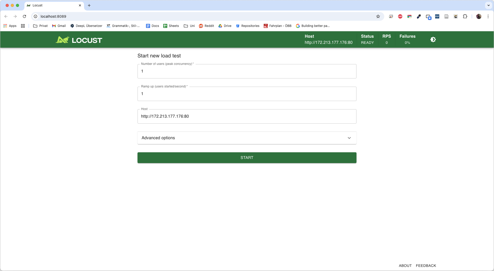

# clc3-2025-project-aghaei-fallmann-steininger
## Overview
In order to keep the Readme as concise as possible, the proposal has been moved [here](./docs/project_proposal.md) and we will only provide a quick overview:

The goal is to develop a ticket sales API that simulates real-world ticketing systems, by implementing artificial delay and randomly denying request. Additionally, latency will be increased by using a database.

Prometheus will be utilized to scrape metrics from the API, and a dashboard in Grafana will display these metrics. Additionally, Grafana will also alert the user once a metric hits a certain criteria. Stress testing will be performed, to show how metrics change and how they are displayed over time.


API, Prometheus and Grafana will be deployed via an **Azure Kubernetes Cluster**. The database is directly hosted on **Azure Database for PostgreSQL**.


## Documentation

### Summary of research
General implementation and local development was guided by [this](https://levelup.gitconnected.com/monitoring-fastapi-with-grafana-prometheus-a-5-minute-guide-658280c7f358) tutorial showcasing the combination of FastAPI, Prometheus and Grafana. 

To gain the advantages of **flexible scaling** and **self-healing** (automatic restart after a crash) provided by Kubernetes, we chose to deploy the applications as a Kubernetes cluster instead of using standalone Azure VMs.

Although managed Azure versions of Grafana and Prometheus exist, they were not accessible via the Student Subscription. Additionally, the Kubernetes custom resource definition `ServiceMonitor` exists. This approach facilitates Prometheus to automatically discover services in the cluster. In order to gain a detailed insight into the workings of Prometheus, we chose to deploy our own Prometheus pod.  

We made use of **Config Maps** and **Secrets** to store non-confidential and confidential data respectively. In doing so, the pods become way more flexible. For instance, the data source that Prometheus scrapes can be easily extended/changed and the Grafana dashboard can be adjusted.

### Metrics and Alerts
By default Prometheus collects a lot of system metrics automatically. These include the CPU and memory usage of the machine/container that the application runs on. In the FastAPI backend, we additionally defined the metric of **http_requests_total**, which counts the HTTP requests, and labels them by method, endpoint and status. This allows us to create visualization of failed requests and requests per endpoint. 

Furthermore, we defined alarms in Grafana. These are triggered when a metric hits a certain condition. In our case, these alerts are sent to a Discord server. This ensures that officials are notified of severe problems without needing to monitor the dashboard 24/7.

### Tutorial
#### Developing the API
Development of this project was aided by the use of a development container. Refer to [this](https://code.visualstudio.com/docs/devcontainers/containers) source on how to use a dev container. 

The code for the API, as well as definitions of database models are located in the directory [clc3_project/backend](./clc3_project/backend). 

To test the whole system (Database, API, Prometheus & Grafana) locally, you can use the [docker-compose_monitoring.yml](./docker-compose_monitoring.yml) file. 

### Interaction with the API
Since no user interface was developed for this project, a Postman script is provided [here](./postman_collection/API%20Endpoints.postman_collection.json) to interact with the API. Concerts can be created, tickets can be purchased. The script can be used for the local and deployed system. The host and port are defined as variables and need to be changed accordingly.

It is important that at least one concert is created before the execution of the stress test, otherwise, all requests will fail. 

#### Deployment
A detailed tutorial can be found [here](./docs/deployment.md). Here we will give a quick overview of the necessary steps.

0. **CI Pipeline:** Push changes to `main` to trigger the GitHub Action. This builds the API and pushes it to Docker Hub. **Wait for this to finish.**

1. **Configuration:** If Prometheus or Grafana configs changed (e.g., a new contact point), delete the old ConfigMaps and create new ones.

2. **Secrets:** If the database or Discord webhook changes, delete and recreate the Kubernetes Secrets.

3. **Connection:** Connect to the AKS cluster via the Azure CLI.

4. **Deployment:** Update the image tag in `ticket_app.yml` to match the new build. Apply the manifest and restart the rollouts to pull the new image.

#### Stress testing
In order to show metric changes in the Grafana dashboard, we utilized the Python library **locust**. This tool is used for stress testing, i.e., sending a lot of request to a server. We implemented two different test cases:
1. Stress testing of the regular purchasing endpoint
2. Stess testing of the purchasing endpoint that randomly denies requests as a means to simulate the real world ticket platforms. 

Both stress tests query the concerts endpoint to check which concerts are available, and subsequently send a purchase request for this concert using a random email and a random ticket quantity. 

You can start either of tests by openening the project in the dev container and navigating to the stress test directory:

```bash
cd ./clc3_project/stress_test
```

To start a test, you can execute the following command and either use `locustfile.py` or `locustfile_random_deny.py` for the locust file:
```bash
locust -f <LOCUST_FILE>
```

You are then prompted to open a link in your browser. The UI lets you configure the host address to test and the number of users. 

(Hint: the host address is pre-onfigured in the locust file but can be adjusted in the UI)




### Lessons learned
While developing the proposed project, a few challenges occured, which we were able to overcome.

#### Azure Student Subscription
Using the Student Subscription that is provided by the University has a lot of advantages. However, some features (e.g., managed Grafana) are not available, and creation of available resources often failed.

#### Kubernetes cluster
Although, this seemed to be a huge and complicated task upfront, the actual deployment went rather smoothly.

#### Switching of Database through parameterization
The initial approach utilized a Postgres database hosted on a pod in the cluster. Later we decided to use an `Azure Database for PostgreSQL flexible server`. By providing the connection string as an environment variable stored in a Kubernetes secret, the migration was exceptionally easy and required no changes to the application code.


